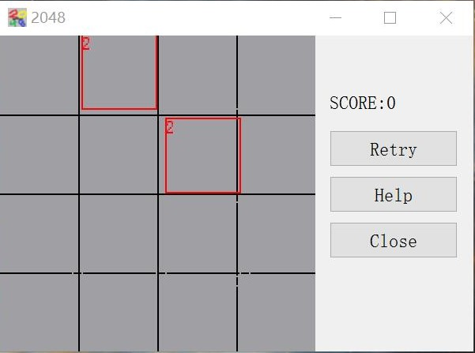

# 2048python #

   ## version ##

   2048python version 1.0

   [2021/9/11]

   ## overview ##

   (1)2048python is a opensource python project for the game of 2048.
      Technologies:Python3, PyQt5.

   (2)Rules of the game:
      Each time you can choose to slide up and down in one direction, each time, all the digital blocks will be close to the direction of sliding, the system will also appear in the blank space of a number square, the same number of squares in close, collision will add up. The system gives the number square is either 2 or 4, the player to find a way in this small 16 grid range to come up with "2048" number square.

   ## usage ##

   (1)If you already have Python and PyQt5, you can just now running the file of:py/Main.py.Or if your os is windows, you can run the .exe file just now!

   (2)If you are not get ready, you can look at the install step:
   
   If all is right, you can see the window like this:
   

   ## sounds ##

   pop.wav 
   - Original filename: 7424__room__perc-pop2.wav 
   - License: CC Attribution, by room, 9/1/2005 
   - Source: http://www.freesound.org/people/room/sounds/7424/
   
   blip.wav 
   - Original filename: 4359__noisecollector__pongblipf4.wav 
   - License: CC Attribution, by NoiseCollector, 7/17/2005 
   - Source: https://www.freesound.org/people/NoiseCollector/sounds/4359/

   ## install ##

   ### On the first, you need to install python ###

   Clicked the link to go to the web station:[http://python.org/downloads], choose the installer for your os.

   ### Then, running the installer ###

   Download the installer, then running. Please choose [AddToPath] then install.

   ### Next, install the libraries ###

   Open the tereminal, running:

      pip install PyQt5

   If your os is Mac or Linux, running:
   
      pip3 install PyQt5

   ### Finally, running! ###

   Then open the file:py/Main.py to run.

   Enjoy!